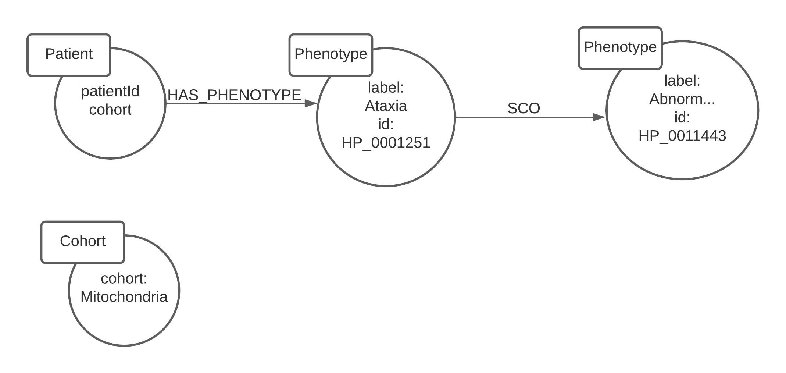

# Clinical Database + API
## Table Of Contents
  * [Dev setup](#dev-setup)
    + [1. Clone the repo](#clone-the-repo)
    + [2. Setup env vars](#setup-env-vars)
    + [3. Start the Neo4J container](#start-the-neo4j-container)
    + [4. Connect to the Neo4J interface](#connect-to-the-neo4j-interface)
    + [5. Import the HPO ontology](#import-the-hpo-ontology)
      - [Create unique n10s URI constraint](#create-unique-n10s-uri-constraint)
      - [Initialise n10s](#initialise-n10s)
      - [Import the ontology](#import-the-ontology)
      - [Check it loaded correctly](#check-it-loaded-correctly)
    + [6. Start the API](#start-the-api)
    + [7. Import the patient data](#import-the-patient-data)
      - [Wait for the container to be fully initialised](#wait-for-the-container-to-be-fully-initialised)
      - [Access the API container](#access-the-api-container)
      - [Seed the patient data](#seed-the-patient-data)
    + [Errors](#errors)
      - [sqlite3 must be manually installed](#sqlite3-must-be-manually-installed)
  * [Adding a cohort](#adding-a-cohort)
    + [1. Edit the cohort.pheno.json](#1-edit-the-cohortphenojson)
    + [2. Write a parser for the JSON file](#2-write-a-parser-for-the-json-file)
    + [3. Update mapping.js](#3-update-mappingjs)
    + [4. Write a seeder for the cohort in seeders](#4-write-a-seeder-for-the-cohort-in-seeders)
    + [5. Seed the database](#5-seed-the-database)
    + [Further steps](#further-steps)
  * [Removing a cohort](#removing-a-cohort)
    + [1. Remove data from Neo4J](#1-remove-data-from-neo4j)
    + [2. Remove files you added](#2-remove-files-you-added)

## Dev setup
### Clone the repo
```
git clone https://github.com/gene-trustee/clinical.git && cd clinical
```
### Setup env vars
Look at .env.example
### Start the Neo4J container
```
docker-compose up -d clinical-db
```
### Connect to the Neo4J interface
This can either be navigating to http://localhost:7474 for a GUI, or by attaching a shell to the container and running `cyphershell` for a CLI.
Username is neo4j, database is Neo4J and password is what you specified in .env
### Import the HPO ontology
#### Create unique n10s URI constraint
```
CREATE CONSTRAINT n10s_unique_uri ON (r:Resource)
ASSERT r.uri IS UNIQUE
```
#### Initialise n10s 
```
CALL n10s.graphconfig.init({
  handleVocabUris: 'IGNORE'
})
```
#### Import the ontology
```
CALL n10s.onto.import.fetch("https://raw.githubusercontent.com/obophenotype/human-phenotype-ontology/master/hp.owl","RDF/XML");
```
#### Check it loaded correctly
```
MATCH (m:Class) return m;
```
### Start the API
```
docker-compose up -d clinical-api
```
### Import the patient data
#### Wait for the container to be fully initialised
You will probably get errors like "sqlite3 must be manually installed" if you don't want for the container to start fully. Check with docker logs.
#### Access the API container
```
docker exec -it [container] bash
```
Where [container] is probably [docker compose folder]_clinical-api_1.
#### Seed the patient data
```
npx sequelize-cli db:seed:all
```

### Errors
#### sqlite3 must be manually installed
Wait for the API container to finish its `npm ci` step. If that has finished, try `npm rebuild`.

## Adding a cohort
This is a bit of an annoying and involved process. Overall, you need to:
1. Edit the cohort.pheno.json file so the internal/external IDs match Vectis
2. Write a parser for the cohort.pheno.json in ./helpers/
3. Update ./helpers/mappings.js
4. Write a seeder for the cohort in ./seeders/
5. Seed the database

### 1. Edit the cohort.pheno.json
Vectis has internal and external IDs for the cohorts. For example, in MITO, the external IDs shown on the Vectis webpage are MITO000XXX, but the IDs passed to the API are 17W000XXX, BUT the external IDs in the JSON file are A0XXXXX. Edit the file so the externalIDs key matches what is shown on Vectis frontend, and internalIDs match what is used in the API. You might have to make a CSV of Vectis frontend IDs and backend IDs and write a script to do this automatically, or you might get lucky and it's just changing the prefix of the IDs with a simple find/replace. It's a case-by-case basis thing.

### 2. Write a parser for the JSON file
Now you have to take in the JSON file and convert it to an array of patients. Patients are simple. It's an array where the first element is an object with key/value pairs of patient details, and the second element is an array of phenotypes. Since each cohort.pheno.json is different, each parser will have to be slightly different. Here's an example from MITO:
```js
module.exports = (trelloInput) => {
  var patients = [];

  trelloInput.forEach((tPatient) => {
    // patient[0] = patient obj
    // patient[1] = array of phenotypes objs
    var patient = [{}, []];

    patient[0].patientId = tPatient.externalIDs;
    patient[0].gender = tPatient.Gender;

    tPatient.Condition.forEach((phenotype) => {
      patient[1].push(phenotype);
    });

    patients.push(patient);
  });

  return patients;
};
```
For a more complicated example, check out ./helpers/phenotipsToPatient.js

### 3. Update mapping.js
Vectis API uses different names for the cohorts. For example, to query Acute Care, you have to use "acutecarepro" in the payload. This is unintuitive, so we have a mapping file that takes in the normal name of the cohort and returns the Vectis name. To find the Vectis name, make a query in clinical filtering and check the response.

### 4. Write a seeder for the cohort in seeders
Almost done. Now we have to write a seeder to tell sequelize how to insert the data into Neo4J. You can basically just copy one of the other files and change the parser amd file. It might require some modifications, but by and large your parser should be written such that this is painless.

### 5. Seed the database
This is just attaching to the container and running the command from above.

### Further steps
Remember you will also need to edit Custodian and Patient-Discovery-BE and Patient-Discovery-FE (thanks mappings!)

## Removing a cohort
### 1. Remove data from Neo4J
Navigate to http://localhost:7474 (or run `cypher-shell` for CLI on a server) and login. Then, run:
```
MATCH (m:Patient)
WHERE m.cohort = "[Cohort]"
DETACH DELETE m;
```
And run:
```
MATCH (m:Cohort)
WHERE m.cohort = "[Cohort]"
DETACH DELETE m;
```
### 2. Remove files you added
Delete the parser you wrote in the `helpers` folder, and the seeder in the `seeders` folder to prevent the cohort being readded next time you seed the database.

## CI/CD
### Setup
Download the github self hosted run as per their [documentation](https://docs.github.com/en/actions/hosting-your-own-runners/adding-self-hosted-runners). Run the `./config.sh`, nothing special needs to be set here, so give it whatever name and accept the defaults provided.

### Production
Triggered on push to master, this will:

    1. Clone this repo to Holon
    2. Build the docker images listed in the compose file
    3. Bring them up.
It will also print some debug information 
### Staging
Triggered on a pull request, this will:

    1. Clone the branch to holon
    2. Build the docker images listed in the staging compose file
    3. Bring the images up with ports+1000 (e.g. 4000 on prod will be 5000)

## Database Schema
Given the nature of a graph database, there isn't really a schema. In saying that, I can give some details as to how it generally relates. The main data inside the database is the Human Phenotype Ontology. This was imported manually when you created the database. When a cohort is added, it's not really adding a "cohort". It's adding many individual patients nodes to the graph that happen to have a common cohort attribute. Aside from that attribute, there is no real record of the cohort. This isn't ideal, so while adding all the patients I also add a single cohort node with the cohort name as its label so it's easy to pull out what cohorts are actually in the database.



## Docs
Docs are generated by apiDoc and are located in `apidocs`. They can be viewed by opening `apidocs/index.html`. They can be regenerated by [installing apiDoc](https://apidocjs.com/) and running `apidoc -i routes -o apidoc`.
